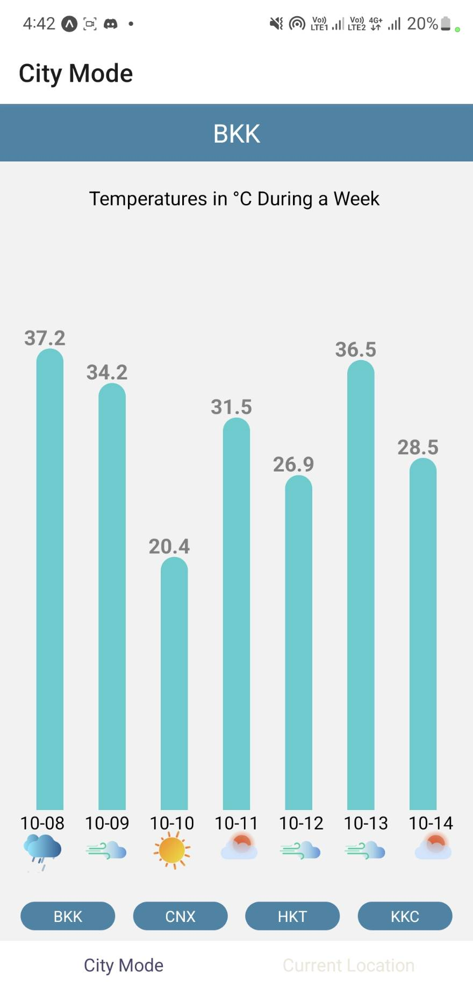
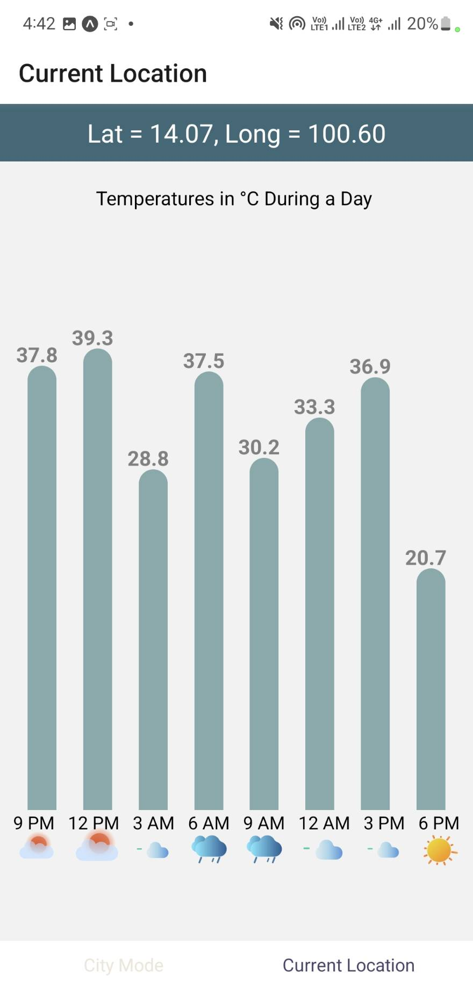

# Midterm Project Submission for DES427
Designed by:
- Tandin Dorji 6222790428
- Kannokarn Pinkeaw 6222790147
- Sirinada Sanprasert 6222782698 

This is a multi page react native application that displays the weather forecast with the help of an interactive and dynamic UI design. This project involves fetching an api call to gather the weather updates for various locations which is then used to generate an animated bar chart.
The application has two main modes:
1) The City Mode
This mode showcases the weather forecast for 4 major cities in Thailand over the course of a week. The cities can be switched by clicking on the buttons below the animated chart.
2) The Current Location Mode
This mode requires the users permission to access their Current location. After which the application uses the user's current location and fetches the weather forecast for the users current location over the period of a day.

